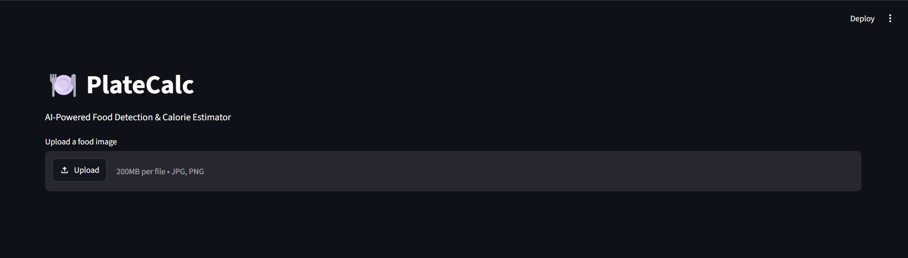
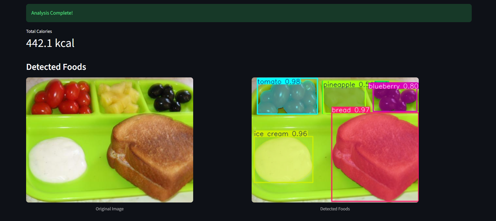
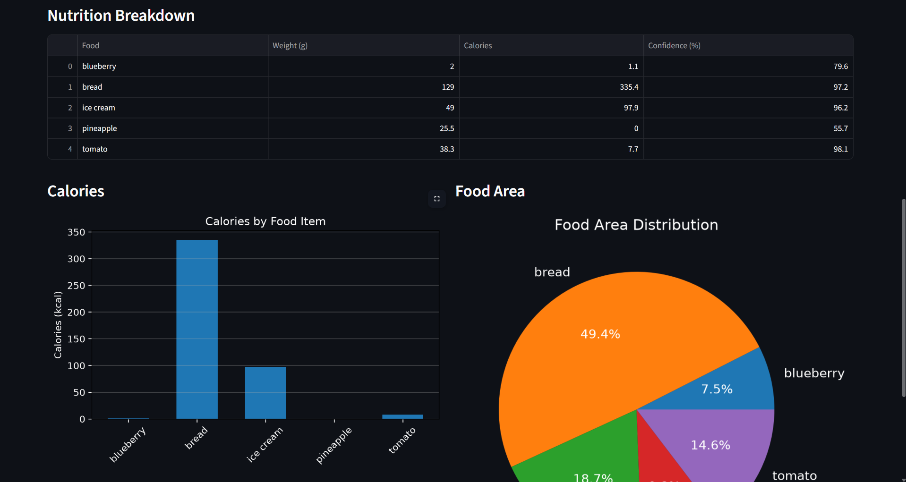

# 🍽️ PlateCalc


> AI-powered food calorie estimation from a single food image using YOLOv8 Segmentation, OpenCV, and the USDA FoodData Central API.

---

## 📌 Project Overview

PlateCalc is an end-to-end computer vision application that estimates the calorie content of a meal from a single image.

The project combines deep learning, image processing, and external nutritional data to detect food items, estimate their quantities, and calculate approximate calories.

The complete pipeline consists of:

Image → Food Segmentation → Portion Estimation → Nutrition Lookup → Calorie Calculation

## 📸 Demo

### 1. Home Screen

Upload a food image through the Streamlit interface to begin the analysis.

<p align="center">

</p>

### 2. Food Detection

The trained YOLOv8 segmentation model detects multiple food items, predicts segmentation masks, and labels each object with its confidence score.

<p align="center">

</p>

### 3. Nutrition Dashboard

The application estimates food weights, calculates approximate calories using USDA FoodData Central, and visualizes the results through tables and charts.

<p align="center">

</p>

---

## ✨ Features

- YOLOv8 Segmentation-based food detection
- Instance segmentation masks
- Automatic detection of multiple food items
- Connected Component Analysis for countable foods
- Area-based weight estimation for region-based foods
- USDA FoodData Central API integration
- Automatic calorie computation
- Interactive Streamlit web interface
- Nutrition summary with visualizations

---

## 🛠 Tech Stack

- Python
- YOLOv8 (Ultralytics)
- OpenCV
- NumPy
- Matplotlib
- Pandas
- Streamlit
- USDA FoodData Central API
- Google Colab (GPU model training)

---

# ⚙️ Project Pipeline

## 1. Dataset Preparation

The project uses the FoodSeg103 dataset.

The segmentation masks were converted into the YOLOv8 segmentation format by:

- Reading semantic masks
- Extracting binary masks for each class
- Detecting contours using OpenCV
- Converting contours into normalized polygons
- Saving YOLO-compatible segmentation labels

---

## 2. Model Training

The YOLOv8 segmentation model was trained on the FoodSeg103 dataset using **Google Colab** with GPU acceleration. The trained weights (`best.pt`) obtained from this training are included in this repository for inference.

The trained model predicts:

- Food class
- Bounding box
- Segmentation mask
- Confidence score

---

## 3. Food Detection

Given an image,

the model performs inference and detects all visible food items.

Low-confidence detections are filtered using a configurable confidence threshold.

---

## 4. Quantity Estimation

Two different estimation strategies are used.

### Countable Foods

Examples:

- grapes
- apples
- eggs
- blueberries

These foods are counted using Connected Component Analysis.

Estimated Weight

Weight = Number of Objects × Average Weight

---

### Area-Based Foods

Examples:

- rice
- bread
- meat
- curry
- vegetables

The segmentation mask area is used as a proxy for portion size.

Estimated Weight

Weight = Mask Area × Scale Factor

---

## 5. Nutrition Lookup

The USDA FoodData Central API is queried for every detected food item.

To improve accuracy:

- category names are mapped to USDA-compatible names
- raw food entries are preferred
- Foundation datasets are prioritized where possible
- API responses are cached to reduce repeated requests

---

## 6. Calorie Estimation

Calories are computed using

Calories = (Estimated Weight × Calories per 100g) / 100

The calories of all detected foods are then summed to estimate the total meal calories.

---

# 🖥 Streamlit Interface

The application provides an interactive web interface where users can

- upload an image
- view the detected foods
- inspect segmentation masks
- see estimated weights
- view calorie estimates
- visualize calorie and food-area distributions

---
## 🚧 Challenges Faced

### Dataset Conversion

FoodSeg103 provides semantic segmentation masks whereas YOLOv8 expects polygon annotations. A preprocessing pipeline was implemented using OpenCV contour extraction to convert masks into YOLO-compatible segmentation labels.

### Portion Estimation

Estimating food weight from a single RGB image is inherently difficult because depth information is unavailable. To address this limitation, two heuristic approaches were implemented:
- Connected Component Analysis for countable foods.
- Mask-area based estimation for region-based foods.

### USDA API Matching

Food names in FoodSeg103 often differed from USDA FoodData entries. A mapping layer and preference for raw food entries were introduced to improve nutritional lookup accuracy.

### Streamlit Integration

The inference pipeline was separated from the UI, allowing the Streamlit frontend to remain modular and reusable.

---
# 📂 Repository Structure

```
PlateCalc/
│
├── app.py                    # Streamlit interface
├── calorie_estimator.py      # Main inference pipeline
├── nutrition_db.py           # Weight heuristics & USDA mappings
├── usda_api.py               # USDA API integration
├── prepare_dataset.py        # Dataset conversion
├── train.py                  # Model training
├── foodseg.yaml              # YOLO dataset config
├── model/
│   └── best.pt               # Trained YOLO model
├── requirements.txt
└── .env.example
```

---

# 🚀 Running the Project

## 1. Clone the repository

```bash
git clone https://github.com/Rudy200724/PlateCalc.git
cd PlateCalc
```

---

## 2. Create a virtual environment

Windows

```bash
python -m venv .venv
.venv\Scripts\activate
```

Linux / macOS

```bash
python3 -m venv .venv
source .venv/bin/activate
```

---

## 3. Install dependencies

```bash
pip install -r requirements.txt
```

---

## 4. Obtain a USDA API Key

Create a free API key from

https://fdc.nal.usda.gov/api-guide

---

## 5. Create a `.env` file

Copy

```
.env.example
```

to

```
.env
```

and add

```env
USDA_API=YOUR_API_KEY
```

---

## 6. Launch the application

```bash
streamlit run app.py
```

---

# 📊 Current Limitations

- Weight estimation uses simple heuristics.
- Portion estimation does not use depth information.
- Similar-looking foods may occasionally be misclassified.
- Calories are approximate rather than nutritionally precise.
- Detection accuracy depends on image quality.

---

# 💡 Future Improvements

- Monocular depth estimation for better portion estimation
- Volume estimation instead of area scaling
- Better heuristic calibration using real-world measurements
- Support for nutritional information beyond calories
- Mobile application deployment
- Cloud-hosted inference
- Real-time webcam support

---

# 📚 What I Learned

This project helped me understand several important concepts in computer vision and machine learning.

### Deep Learning

- Training a custom YOLOv8 Segmentation model
- Understanding semantic vs instance segmentation
- Confidence thresholding
- Model inference workflow

### Computer Vision

- Image preprocessing
- Binary masks
- Contour extraction
- Connected Component Analysis
- Mask area computation
- Polygon generation for YOLO segmentation labels

### Data Processing

- Preparing datasets for segmentation models
- Converting annotation formats
- Working with segmentation masks

### APIs

- Integrating the USDA FoodData Central API
- Parsing JSON responses
- Handling inconsistent search results
- Implementing response caching

### Software Development

- Building a modular Python project
- Separating UI and backend logic
- Creating an interactive Streamlit application
- Using Git and GitHub for version control

---
## 📚 References

- FoodSeg103 Dataset: https://xiongweiwu.github.io/foodseg103.html
- Ultralytics YOLOv8 Documentation: https://docs.ultralytics.com/
- USDA FoodData Central API: https://fdc.nal.usda.gov/api-guide
- OpenCV Documentation: https://docs.opencv.org/
- Streamlit Documentation: https://docs.streamlit.io/

---

# 🙏 Acknowledgements

- DevSoc BITS Goa for the induction project
- Ultralytics YOLOv8
- FoodSeg103 Dataset
- USDA FoodData Central API
---

## 👨‍💻 Author

**Rudransh Sharma**

BITS Goa — Computer Science

DevSoc Induction Project
